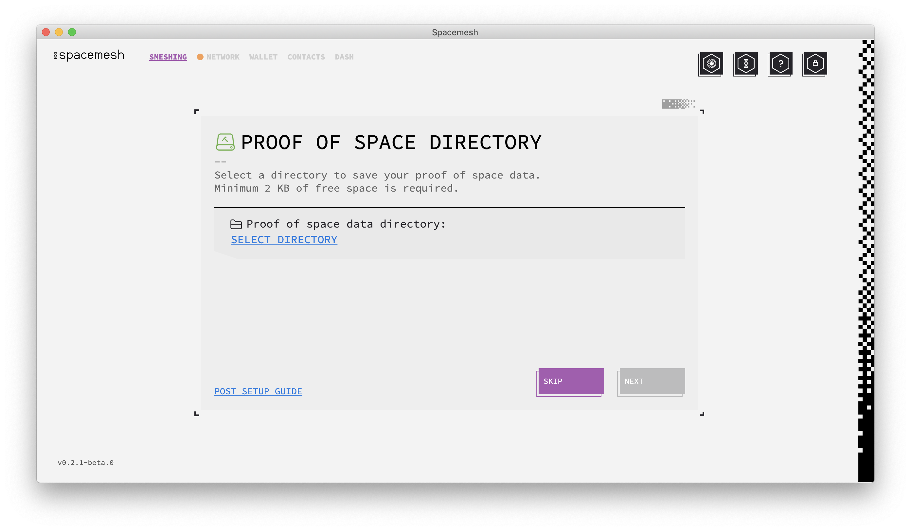
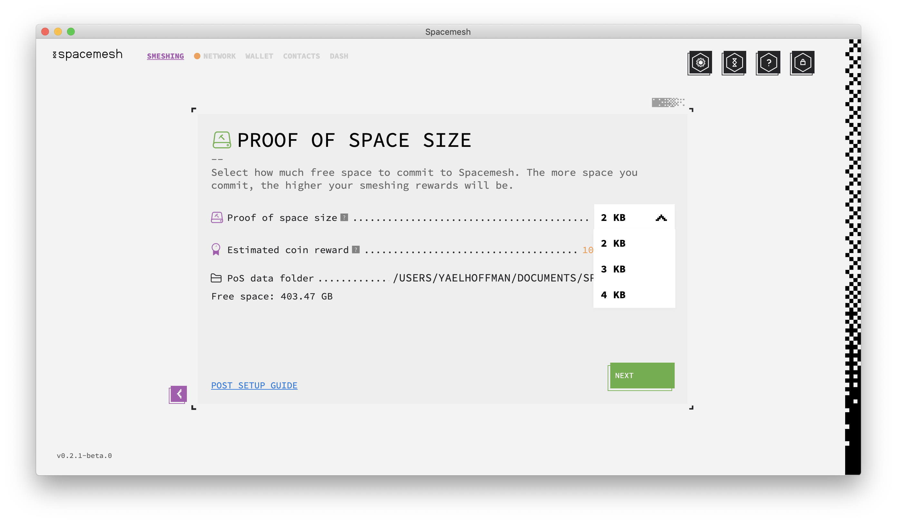
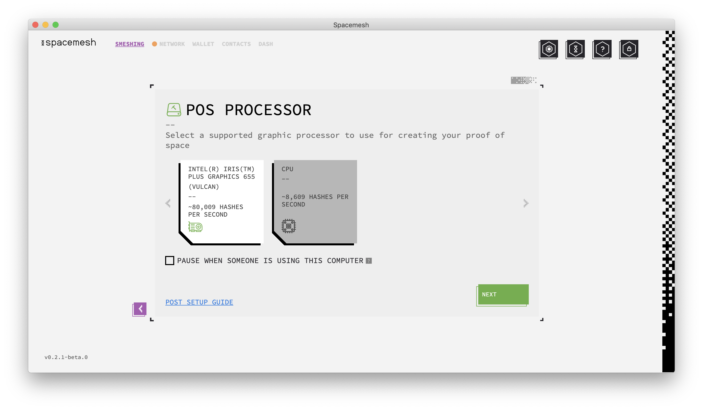
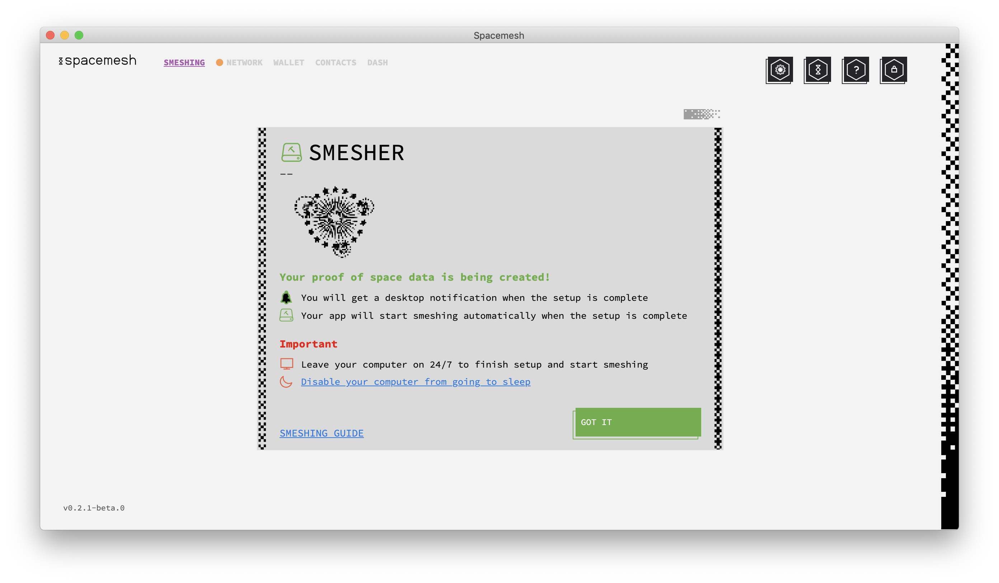
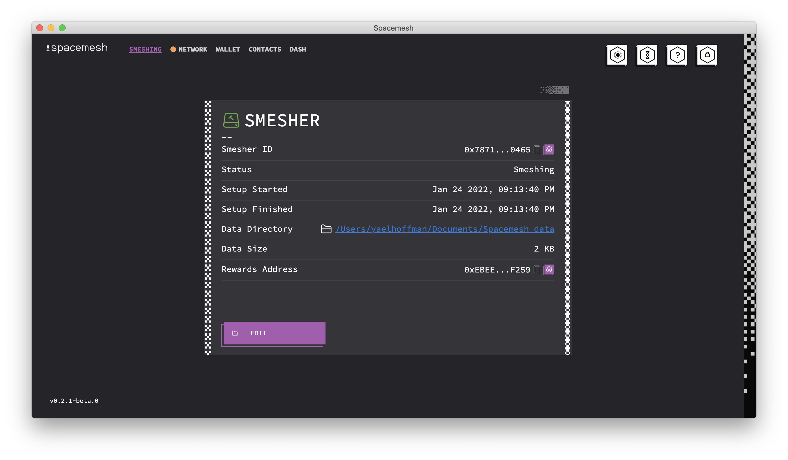
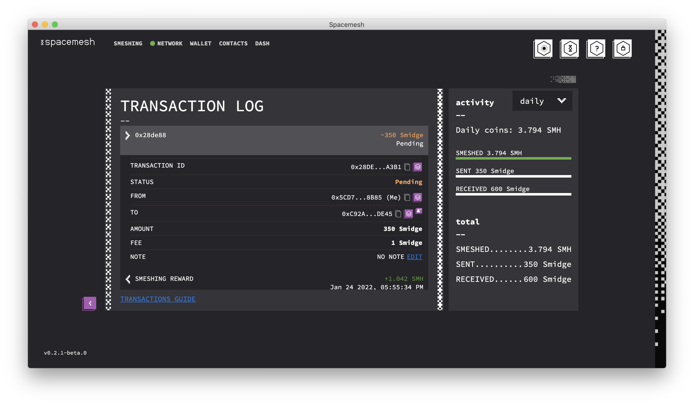

Smeshing is the process of submitting blocks with transactions to the Testnet network according to the Spacemesh protocol. Before you can Smesh blocks, you need to commit free storage on your computer hard drive to Spacemesh

# Running a local node

In order to start smeshing you have to run a full Spacemesh p2p node. When running the Smapp for the first time you will be prompted to set up a node. Click **<WALLET + NODE>**

# Setting up Smeshing

After the configuration of the wallet, covered in another section, you need to setup the Proof of Space Directory. First you have to select the directory where de data will be stored. At this moment the minimum free space required is 2KB. To do it, you have to click on **SELECT DIRECTORY**

Once selected the directory, in our case we created a new directory called post in C:\\ the **<NEXT>** button turns green and now we can click it to continue

The next step is to select how much free space we want to commit to Spacemesh. The more space you commit, the higher your smeshing rewards will be. We select the maximum available at this point, 4KB, and click on **<NEXT>**

Now is time to select how we want to create the proof of space, all the options available for us will appear in this section. The **NEXT** button will remain gray till we make a choice.

> _The GPU options are faster than the CPU ones. Inside the box you can check the number of hashes per second._

Also we have a checkbox available that allows us to pause the PoS creation when someone uses the computer

Before create the data the Smapp will show us a summary with the creation options selected. If all is correct the we can click **<CREATE DATA>**, if not we can click **<** and go back to change it

Finally, the proof of space data is being created, the app will start smeshing automatically when the setup is complete.

We have to leave the computer on 24/7 to smesh and be sure that the computer wont hibernate

Click **<GOT IT>** to finish the set up

# Viewing smeshing status

All the information related to the smeshing process is under the menu **SMESHING**

)

There, we can view the node ID, the space allocated as a Proof of Space and the status of the node. If the node is working well you will have the Status: **Smeshing**

# Changing smeshing setup

If we want to change the configuration of the node we have to click on **<EDIT>**

Now you can **Change the PoS data** or **Stop smeshing and delete PoS data**. You have to click on the corresponding button

## Modifying PoS data

This process is the same as initial configuration.

## Stop smeshing

If you want to stop smeshing and delete PoS data click on **<DELETE DATA>**

In order to smeshing again you will have to setup the proof of space again

## Viewing your smeshing rewards

To view the smeshing rewards you have received you have to go to the Menu **WALLET**

At the right of the screen you can see the last transactions, including the smeshing rewards. If you want to see all the transactions click **<ALL TRANSACTIONS>**

A new windows with the log of the transactions appears, at the right you can see a daily, monthly or yearly summery of the transactions. **SMESHED** refers to the smeshing rewards.

If you want to view a transaction in detail, you have to click over it and then information will show up

